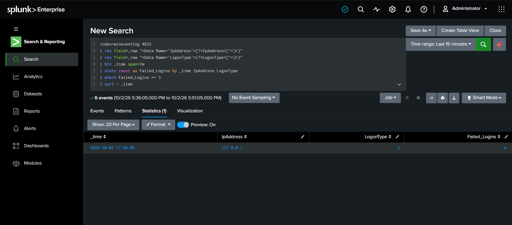
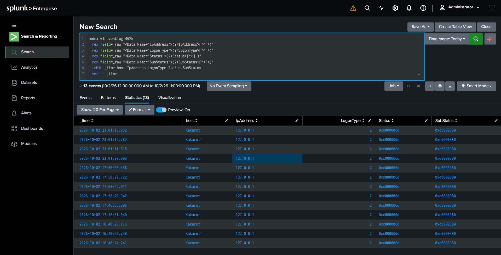
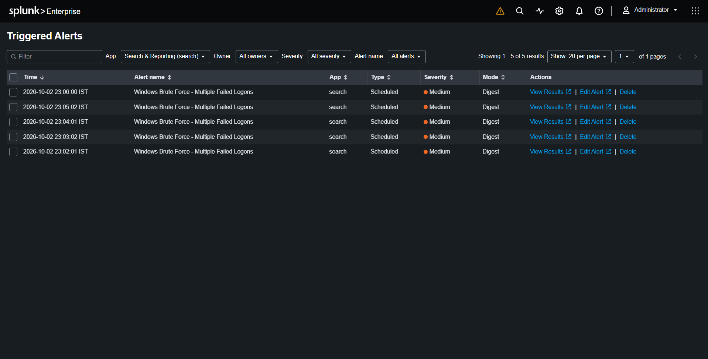

# Windows Brute-Force Detection & Investigation

## Overview

This project demonstrates the detection and investigation of repeated failed Windows logon attempts using **Splunk Enterprise** and **Windows Security Event Logs**.

The activity was generated intentionally on a personal Windows lab machine to simulate a brute-force-style authentication pattern. The purpose of the project was to practice SIEM-based detection, log analysis, alerting, investigation, and incident classification.

## Lab Environment

* **Operating System:** Windows 11
* **SIEM:** Splunk Enterprise
* **Log Collection:** Splunk Universal Forwarder
* **Log Source:** Windows Security Event Logs
* **Splunk Index:** `wineventlog`
* **Virtualization:** Oracle VirtualBox
* **Splunk Server:** Kali Linux VM

## Detection Objective

Detect multiple failed Windows interactive logon attempts occurring within a short period of time.

The detection uses:

* Windows Event ID **4625** — Failed logon
* Source IP address
* Windows Logon Type
* Number of failed attempts
* One-minute time window

## Detection Logic

The detection identifies **3 or more failed logon events within the same one-minute window** from the same source IP and logon type.

```spl
index=wineventlog 4625
| rex field=_raw "<Data Name=\"IpAddress\">(?<IpAddress>[^<]+)"
| rex field=_raw "<Data Name=\"LogonType\">(?<LogonType>[^<]+)"
| bin _time span=1m
| stats count as Failed_Logins by _time IpAddress LogonType
| where Failed_Logins >= 3
| sort - _time
```

## Investigation

After detecting the repeated failures, additional fields were extracted from the raw Windows event data to investigate the authentication failures.

The investigation examined:

* Event timestamp
* Windows host
* Source IP address
* Logon Type
* Authentication Status
* Authentication SubStatus

The lab generated repeated failed interactive logons from `127.0.0.1` on the Windows host `Kakarot`.

The observed failed logons used **Logon Type 2 (Interactive)** and returned authentication failure status codes.

## Alerting

A scheduled Splunk alert was configured:

**Alert:** `Windows Brute Force - Multiple Failed Logons`

### Configuration

| Setting           | Value                            |
| ----------------- | -------------------------------- |
| Schedule          | Every minute                     |
| Search window     | Last 5 minutes                   |
| Severity          | Medium                           |
| Mode              | Digest                           |
| Trigger condition | Number of results greater than 0 |
| Trigger action    | Add to Triggered Alerts          |
| Sharing           | Private                          |

The alert was successfully tested using the controlled lab simulation.

## MITRE ATT&CK Mapping

**T1110 — Brute Force**

The detection behavior is related to the MITRE ATT&CK Brute Force technique because it identifies repeated authentication failures.

This mapping describes the detection scenario; it does not establish that a real-world brute-force attack occurred.

## Lab Classification

**Classification:** Benign / Controlled Lab Simulation

The failed logons were intentionally generated by the analyst on the personal Windows lab machine for detection testing.

No unauthorized system or account was targeted.

## Evidence

### Detection


The detection shows multiple failed logon attempts grouped within a one-minute window.

### Failure Investigation


The investigation shows the extracted authentication fields from the Windows Security events.

### Triggered Alert


The screenshot demonstrates that the configured Splunk alert successfully triggered after the simulated activity.

## Skills Demonstrated

* Splunk Enterprise
* Splunk Search & Reporting
* SPL fundamentals
* Windows Event Log analysis
* Event ID 4625 analysis
* Field extraction using `rex`
* Authentication investigation
* Brute-force detection logic
* SIEM alert configuration
* MITRE ATT&CK mapping
* Security event investigation
* SOC documentation
* Incident classification

## Conclusion

This lab demonstrates an end-to-end SOC investigation workflow: collecting Windows Security events, identifying repeated authentication failures, extracting relevant fields, creating a Splunk detection, configuring an alert, investigating the resulting events, mapping the behavior to MITRE ATT&CK, and classifying the activity as a controlled benign simulation.
